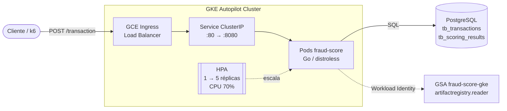
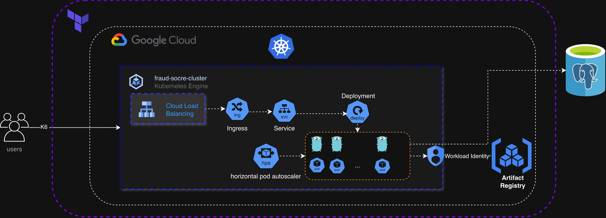
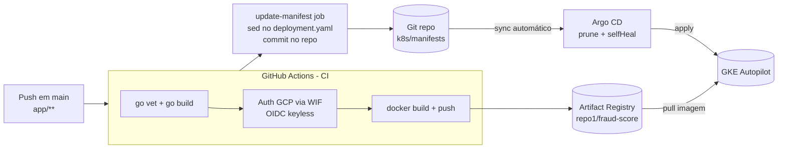
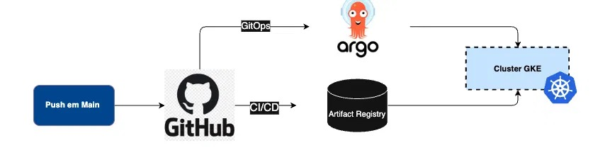
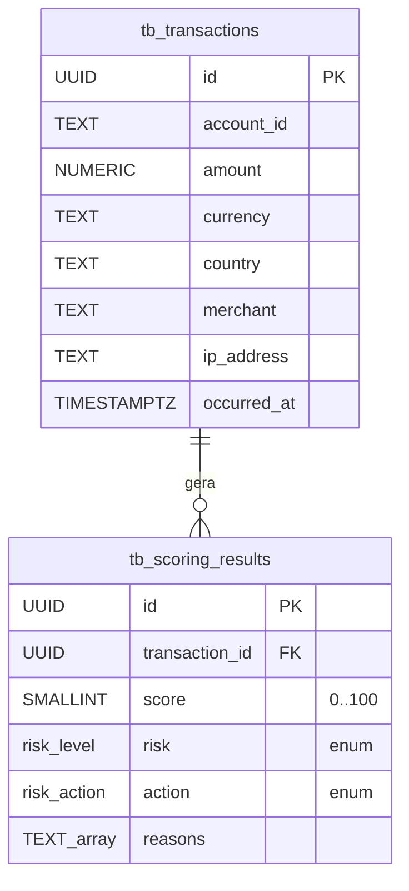

# Fraud Scoring

Motor de **scoring de fraude** para transações financeiras, escrito em **Go**, executando em **GKE (Autopilot)** com entrega contínua via **GitHub Actions + Argo CD (GitOps)** e infraestrutura provisionada por **Terraform** no Google Cloud.

A API recebe uma transação, aplica um conjunto de **regras determinísticas** (rules engine), calcula um **score de risco de 0 a 100**, classifica a transação em um nível de risco e devolve a **ação recomendada** (`approve` / `review` / `block`). Tanto a transação quanto o resultado do scoring são persistidos em **PostgreSQL**.

> O projeto também serve como laboratório de **stress test / autoscaling**: existe um cenário de carga com **k6** rodando dentro do cluster para observar o **HPA** escalando de 1 → 5 réplicas.

---

## Sumário

- [Visão geral](#visão-geral)
- [Arquitetura](#arquitetura)
- [Regras de scoring](#regras-de-scoring)
- [API](#api)
- [Modelo de dados](#modelo-de-dados)
- [Pipeline CI/CD (GitOps)](#pipeline-cicd-gitops)
- [Infraestrutura (Terraform)](#infraestrutura-terraform)
- [Estrutura de pastas](#estrutura-de-pastas)
- [Stack tecnológica](#stack-tecnológica)

---

## Visão geral

| Aspecto | Descrição |
|---|---|
| **Domínio** | Análise de risco de transações (antifraude) |
| **Padrão** | Rules engine determinístico com score ponderado |
| **Entrada** | `POST /transaction` (JSON) |
| **Saída** | Score (0–100), nível de risco e ação recomendada |
| **Persistência** | PostgreSQL (transação + resultado do scoring) |
| **Deploy** | Container distroless em GKE Autopilot, exposto via GCE Ingress |
| **Entrega** | CI (GitHub Actions) → Artifact Registry → CD (Argo CD sync) |

O código-fonte da aplicação segue um layout inspirado em **Clean/Layered Architecture**, separando responsabilidades em camadas:

- **Handler** – transporte HTTP (decode/encode, status codes).
- **Service (EngineService)** – regras de negócio e cálculo do score.
- **Repository** – acesso a dados (SQL).
- **Entity** – contratos de request/response.

---

## Arquitetura

### Fluxo em runtime





### Fluxo de entrega (CI/CD + GitOps)





**Pontos-chave da arquitetura:**

- **Sem chaves de service account** – o CI se autentica no GCP via **Workload Identity Federation (WIF)** com o OIDC do GitHub (`token.actions.githubusercontent.com`), restrito ao owner/repo autorizado.
- **Workload Identity no GKE** – os pods assumem a GSA `fraud-score-gke` (somente leitura no Artifact Registry) sem montar credenciais.
- **GitOps** – o pipeline não faz `kubectl apply`. Ele **atualiza a tag da imagem no manifesto** e commita; o **Argo CD** reconcilia o cluster com o Git (`prune` + `selfHeal`).
- **Segurança do container** – imagem final `gcr.io/distroless/static-debian12:nonroot`, binário estático (`CGO_ENABLED=0`), usuário `nonroot`.

---

## Regras de scoring

O `EngineService` aplica cinco regras independentes. Cada regra retorna uma pontuação e um motivo; o score final é a soma (limitado a **100**).

| Regra | Condição | Pontos | Motivo (`reason`) |
|---|---|---|---|
| **High value** | `amount > 10.000` | +30 | `high_value` |
| **Foreign country** | `country != "BR"` | +40 | `foreign_country` |
| **Suspicious merchant** | merchant contém `casino`, `crypto` ou `bet` | +35 | `suspicious_merchant` |
| **Night transaction** | horário (America/Sao_Paulo) entre 00h–05h | +25 | `night_transaction` |
| **Round number** | `amount` múltiplo de 1000 | +10 | `round_number` |

### Classificação do risco

| Score | Risco | Ação |
|---|---|---|
| `0 – 30` | `low` | `approve` |
| `31 – 60` | `medium` | `review` |
| `61 – 85` | `high` | `review` |
| `86 – 100` | `critical` | `block` |

---

## API

### `POST /transaction`

**Request**

```json
{
  "account_id": "acc-12345",
  "amount": "15000.00",
  "currency": "BRL",
  "country": "US",
  "merchant": "crypto-exchange",
  "ip_address": "200.10.0.1",
  "occurred_at": "2026-08-06T02:30:00Z"
}
```

**Response** — `201 Created`

```json
{
  "response_id": "b2c3...",
  "transaction_id": "a1b2...",
  "score": 100,
  "risk": "critical",
  "action": "block",
  "reasons": ["high_value", "foreign_country", "suspicious_merchant"]
}
```

O `transaction_id` e o `occurred_at` de persistência são gerados pelo servidor (UUID + `time.Now().UTC()`).

**Códigos de status**

| Status | Situação |
|---|---|
| `201 Created` | Transação avaliada e persistida |
| `400 Bad Request` | Corpo JSON inválido |
| `500 Internal Server Error` | Falha ao avaliar/persistir |

---

## Modelo de dados

O schema é criado automaticamente na inicialização (`db.ConnectionDB` → `createTables`).



- `risk_level` → ENUM (`low`, `medium`, `high`, `critical`)
- `risk_action` → ENUM (`approve`, `review`, `block`)
- Índices em `account_id`, `occurred_at`, `action` e `transaction_id`.

---

## Pipeline CI/CD (GitOps)

Arquivo: [.github/workflows/ci-cd.yaml](.github/workflows/ci-cd.yaml). Disparado em `push` na `main` (paths `app/**`) ou manualmente.

**Job `build-and-push`**
1. Checkout + setup Go (via `go.mod`).
2. Validação: `go vet ./...` e `go build ./...`.
3. Autenticação no GCP via **WIF** (keyless).
4. Build e push da imagem para o **Artifact Registry**, com tags `:<git-sha>` e `:latest`.

**Job `update-manifest`**
5. Atualiza a tag da imagem em `k8s/manifests/deployment.yaml` (`sed`).
6. Commita a mudança (`[skip ci]`) → o **Argo CD** detecta e sincroniza o cluster.

---

## Infraestrutura (Terraform)

Provisionada em `infra/terraform/` (backend remoto no GCS: bucket `fraud-score-backend`).

| Arquivo | Recurso |
|---|---|
| `api.tf` | Habilita as APIs do GCP (compute, container, artifactregistry, iam, sts, …) |
| `gke.tf` | Cluster **GKE Autopilot** (`fraud-score-cluster`) |
| `artifact_registry.tf` | Repositório Docker `repo1` |
| `bucket.tf` | Bucket GCS para o state do Terraform |
| `sa.tf` | GSA do GitHub CI (`fraud-score-github`) |
| `wif_ci.tf` | **Workload Identity Pool/Provider** (OIDC GitHub) + binding de writer no Artifact Registry |
| `workload_identity.tf` | GSA `fraud-score-gke` (reader) + binding com o KSA `fraud-score-sa` |
| `argocd.tf` | Instala o **Argo CD** (Helm) e registra a `Application` que aponta para `k8s/manifests` |
| `main.tf` | Providers (google, helm), backend GCS |
| `variables.tf` / `outputs.tf` / `terraform.tfvars` | Variáveis e saídas |

---

## Estrutura de pastas

```
Fraud-Scoring/
├── app/                          # Aplicação Go (API de scoring)
│   ├── cmd/server/
│   │   └── main.go               # Entrypoint: conexão DB + rotas HTTP
│   ├── internal/transaction/
│   │   ├── handler.go            # Camada HTTP (decode/encode)
│   │   ├── service.go            # EngineService: regras + score + classificação
│   │   ├── repository.go         # Acesso a dados (INSERT SQL)
│   │   └── entity.go             # TransactionRequest / TransactionResponse
│   ├── db/
│   │   └── db.go                 # Conexão + criação de schema/tabelas
│   ├── Dockerfile                # Multi-stage build → distroless nonroot
│   ├── docker-compose.yaml       # PostgreSQL para desenvolvimento
│   ├── go.mod / go.sum
│   └── .dockerignore
│
├── k8s/manifests/                # Manifests Kubernetes (fonte da verdade do GitOps)
│   ├── deployment.yaml           # Deployment (tag da imagem atualizada pelo CI)
│   ├── service.yaml              # Service ClusterIP (NEG p/ Ingress)
│   ├── ingress.yaml              # GCE Ingress (Load Balancer externo)
│   ├── hpa.yaml                  # HorizontalPodAutoscaler (1→5, CPU 70%)
│   ├── serviceaccount.yaml       # KSA vinculado à GSA (Workload Identity)
│   └── secret.yaml               # Secret com DATABASE_URL (não versionado)
│
├── infra/terraform/              # IaC do Google Cloud
│   ├── api.tf                    # APIs habilitadas
│   ├── gke.tf                    # Cluster GKE Autopilot
│   ├── artifact_registry.tf      # Repositório Docker
│   ├── bucket.tf                 # Bucket do state
│   ├── sa.tf / wif_ci.tf         # Identidade do CI (WIF keyless)
│   ├── workload_identity.tf      # Identidade dos pods (WI do GKE)
│   ├── argocd.tf                 # Argo CD + Application (Helm)
│   ├── main.tf / variables.tf / outputs.tf / terraform.tfvars
│
├── loadtest/                     # Stress test com k6 (in-cluster)
│   ├── script.js                 # Cenário k6 (ramp-up → carga → ramp-down)
│   ├── k6-job.yaml               # Job + ConfigMap do script
│   └── README.md                 # Como rodar e observar o autoscaling
│
└── .github/workflows/
    └── ci-cd.yaml                # Pipeline CI/CD (build/push + bump manifest)
```

---

## Stack tecnológica

| Camada | Tecnologia |
|---|---|
| **Linguagem** | Go 1.26 (`net/http`, biblioteca padrão) |
| **Libs** | `sqlx`, `lib/pq`, `google/uuid`, `shopspring/decimal` |
| **Banco de dados** | PostgreSQL |
| **Container** | Docker (multi-stage) → distroless `static-debian12:nonroot` |
| **Orquestração** | Kubernetes / GKE Autopilot |
| **Ingress** | GCE Ingress + Load Balancer |
| **Autoscaling** | HorizontalPodAutoscaler (CPU) |
| **CI/CD** | GitHub Actions + Workload Identity Federation |
| **GitOps / CD** | Argo CD |
| **IaC** | Terraform (backend GCS) |
| **Cloud** | Google Cloud (GKE, Artifact Registry, IAM/WIF, GCS) |
| **Load testing** | k6 |
